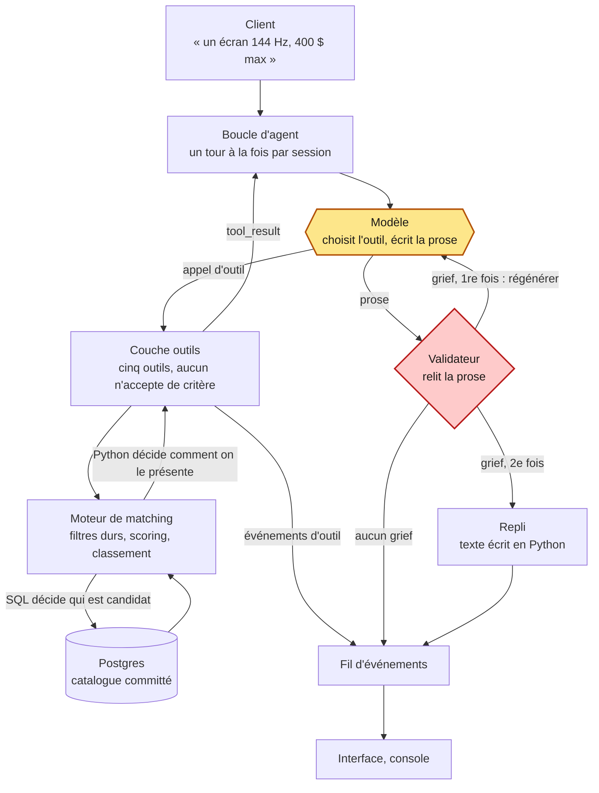

# rAiyon

Assistant conseil produit en temps réel : le client décrit son besoin en langage
naturel, l'assistant dialogue avec lui puis recommande des produits **réels** du
catalogue. Le LLM ne produit jamais un fait — il met en mots des faits que le
code lui a fournis.

## Le chemin d'un message



Le modèle est en jaune, le validateur en rouge, et tout le reste est du code
déterministe. Aucune arête ne va du modèle au fil d'événements sans passer par la porte,
et c'est la seule chose que ce dessin a besoin de montrer.

## Les critères d'acceptation, mesurés

Six critères, arrêtés au cadrage (PROJET.md §4) et **mesurés par le harnais d'éval**. Le
tableau ci-dessous est celui du rapport de la version de prompt en vigueur, que
`make eval` régénère et qui est committé — voir `docs/eval/LISEZMOI.md`, qui dit lequel
des rapports décrit quoi.

| # | Critère | Seuil | Mesuré | |
|---|---|---|---|---|
| 1 | Aucun produit, prix ou spec inventé — **dans le texte livré** | 0 | 0 grief | ✅ |
| 2 | Budget jamais dépassé sans présentation explicite | 0 | 0 violation | ✅ |
| 3 | Délai avant première valeur — en **tours client** | médiane ≤ 2 | 1,0 tour sur 24 prises | ✅ |
| 4 | Le produit attendu est dans le top 3 | ≥ 80 % | 100 % — 12/12 prises à réponse de référence | ✅ |
| 5 | Moteur de matching testable sans API | binaire | `tests/matching/` tourne dans `make check` | ✅ |
| 6 | Cas zéro résultat traité proprement | binaire | 11/11 traités | ✅ |

*Sur 34 prises, 11 scénarios, 77 tours client, prompt `systeme.v2`.
`make eval` sort en code non nul si l'un des critères bloquants — 1, 2 et 6 — est violé,
ou si une attente de scénario n'est pas tenue.
Deux prises sur 36 sont **écartées du compte**, et le rapport le dit en tête : les
correctifs de validateur des étapes 17 et 18 lèvent les faux positifs qu'elles portaient,
donc leurs réponses enregistrées ne sont plus celles que le modèle aurait données. Elles
sont annoncées plutôt que mesurées quand même — voir [Le harnais](#le-harnais).
Quatre autres rapports coexistent dans `docs/eval/` : lequel décrit quoi est dans
`docs/eval/LISEZMOI.md`.*

### Comment lire ce tableau, et pourquoi il ne dit pas ce qu'il a l'air de dire

⚠️ **Les critères nº1 et nº2 sont garantis par construction.** Le validateur refuse le
texte fautif, régénère une fois, puis se replie sur un template écrit en Python : le
texte **livré** ne peut donc pas contenir d'hallucination. Un `0` sur ces lignes ne dit pas
« le modèle n'a pas menti », il dit « le mécanisme a fonctionné ». Une valeur non nulle
signifierait que **le validateur a un trou** — c'est là toute l'information.

C'est pourquoi le rapport publie **trois couches**, et pourquoi les deux suivantes sont les
plus intéressantes :

| Couche | Campagne `systeme.v2` — `docs/eval/rapport.v2.md` |
|---|---|
| Ce qui est **livré** | 0 grief, 0 violation budget — les deux critères ci-dessus |
| Ce que le modèle a **tenté** | **3 griefs refusés sur 77 tours**, soit 0,04 par tour : 1 `montant_non_fourni`, 1 `prix_etranger_au_produit`, 1 `valeur_non_fournie` |
| Ce qui a fini en **repli** | **0 tour sur 77** — aucune réponse dégradée servie au client |

⚠️ **Le taux de rejet ne se lit pas seul.** Il valait 0,13 par tour sur le prompt v1 et
0,04 sur v2, mais l'écart reste **en deçà de la dispersion mesurée** : sur trois prises par
scénario, l'étendue prise-à-prise vaut plusieurs fois cet écart. Ce que la comparaison
démontre vraiment est ailleurs — le markdown que le front n'affiche pas tombe de 51
occurrences à **0**, seul écart au-delà du bruit, et l'appendice de domaine montre un
assistant qui a cessé d'enseigner la technologie d'affichage pour dire ce que le catalogue
contient. Voir `docs/eval/comparaison.v1-base-v2.md`.

> **Un tableau où le critère nº1 vaut 0 et le taux de repli vaut 30 % décrit un produit qui
> échoue.**

Quatre choses que ce tableau ne dit pas, et qui sont écrites au §7 de `PROJET.md` :

- **deux codes de grief sur six ne se déclenchent jamais** — `id_inconnu` et
  `nom_reecrit` —, et ils ne se déclenchent sur **aucune des deux orchestrations**. Le
  rapport le publie, parce qu'une règle qui ne tire jamais est indistinguable d'une règle
  absente. Elles sont exercées par `tests/validateur/test_pieges.py`, pas par les
  scénarios.
  **`ecart_non_dit` est l'histoire de cette ligne, et elle a été fausse deux fois.**
  Elle annonçait trois codes dormants jusqu'à l'étape 15 : la seconde orchestration a fait
  tirer `ecart_non_dit` **24 fois**, il n'était pas dormant, il n'avait jamais été
  sollicité. ⚠️ **Puis l'étape 18 a montré qu'une part de ces 24 était un faux positif** —
  deux règles du validateur pouvaient être conjointement insatisfaisables, et le modèle
  était refusé quoi qu'il écrive. Sur les 24, **2 sont démontrées fausses** (la prise qui
  les portait reste rejouable et n'en lève plus aucune) et **22 sont hors de portée** : les
  prises qui les portaient divergent depuis le correctif et sortent du rejeu. **Un
  compteur qui monte n'est donc pas une preuve que la règle est juste**, et le rapport de
  la machine affiche aujourd'hui `ecart_non_dit` comme muet — avec la réserve qui dit
  pourquoi. C'est écrit en toutes lettres au §5 étape 15 de `PROJET.md`, dont le verdict
  est **suspendu sur cette mesure** ;
- **le critère nº1 ne détecte pas une règle manquante.** Le harnais mesure le validateur
  avec le validateur ; retirer une règle rend les deux aveugles. Ce qui détecte une règle
  manquante, c'est l'effondrement du taux de rejet — vérifié en la retirant pour de bon ;
- **une affirmation de domaine chiffrée passe** dès que le chiffre ne porte pas d'unité
  connue. Mesuré sur v1 : « le contraste d'une VA, c'est 3000:1 » est livré sans qu'aucune
  règle ne le voie. Le correctif est **au prompt** — la section 13 de v2 dit à l'assistant
  ce qu'il ne sait pas et le fait basculer sur la répartition du catalogue —, pas au
  validateur, qui n'a aucun moyen honnête de trancher une affirmation qu'aucun outil ne
  fonde ;
- **sur le jeu archivé, le taux de repli est passé de 0 % à 2 % sans qu'une cassette
  change.** Le produit ne
  s'est pas dégradé : le motif de repli `REPONSE_VIDE` lui a donné de quoi compter un
  tour où le client ne recevait **rien** — `docs/eval/rapport.v1-etape12.md`.

### Les deux orchestrations, et où chacune gagne

Le produit tourne de **deux façons**, et la seconde a été écrite pour mesurer la première.
Tout est partagé sauf la conduite du tour de parole : même catalogue, même moteur, même
couche outils, même validateur, et un prompt qui ne diffère que des trois sections passées
dans le code (`prompts/systeme.machine.v1.md` est `systeme.v2.md` moins §5, §6 et §8 — une
soustraction pure, vérifiée par un test).

| | agent — la boucle d'outils | machine à états |
| --- | --- | --- |
| Qui décide de l'outil suivant | le modèle | `raiyon/machine/decision.py`, **pure** |
| Critères nº1, nº2, nº6 | tenus | tenus |
| Critère nº3 — délai avant valeur (médiane) | 1,0 tour | 1,0 tour |
| Critère nº4 — attendu en top 3 | 12/12 — 100 % | 8/9 — 89 % |
| Taux de rejet du validateur | 3 sur 77 tours — 0,04/tour | 10 sur 69 tours — 0,14/tour ⚠️ |
| Taux de repli | 0 sur 77 — 0 % | 1 sur 69 — 1 % ⚠️ |
| Mesure nº7 — appels par tour | 2,32 | **2,09** |
| Mesure nº7 — entrée facturée | 342 154 jetons | **534 629 jetons** |
| Mesure nº8 — conduite testée hors ligne | **0** | **17** |

*Tout vient de `docs/eval/rapport.v2.md` et `docs/eval/rapport.machine.v1.md`, jetons
compris depuis l'étape 16 : la mesure nº7 les publie, et l'écart des deux campagnes est dans
`docs/eval/comparaison.v2-machine.v1.md`.*

⚠️ **Les deux lignes marquées ci-dessus portent sur 30 prises de la machine sur 36, et
c'est le point le plus important de ce tableau.** Le correctif de validateur de l'étape 18
fait diverger six prises de `machine.v1`, qui sortent du rejeu — et elles portaient **22 des
24 `ecart_non_dit`** de la campagne, c'est-à-dire l'unique écart au-delà de la dispersion.

**Jusqu'à l'étape 18, cette place portait un verdict** : « un seul écart dépasse la
dispersion, et c'est la machine qui le perd — le taux de rejet, +15,67 par passe pour une
étendue de ± 11,00, dominé par `ecart_non_dit` (0 → 24) ». Il n'est plus soutenable en
l'état, et il n'est pas remplacé par son contraire. Ce qui est su : sur les 24, **2** sont
démontrées faux positifs — la prise qui les portait reste rejouable et n'en lève plus
aucune. Ce qui ne l'est pas : les **22** autres, dont les prises ne sont plus comptables.

`docs/eval/comparaison.v2-machine.v1.md` se réduit aujourd'hui aux **9 scénarios communs**
et n'y voit **aucun écart au-delà de la dispersion**. ⚠️ Ce n'est pas un démenti : c'est la
disparition de ce qui permettait de trancher. Trancher pour de bon demanderait de
réenregistrer la campagne de la machine sous le validateur corrigé — ~176 appels, arbitrage
non pris. `PROJET.md` §5 étape 15 porte le verdict **suspendu**, avec ce qu'il faudrait pour
le rouvrir.

> **Où gagne chacune.** La machine gagne la **testabilité de sa décision** et rend explicite
> un invariant que personne n'avait écrit — « ne pas chercher tant que le budget manque »
> n'était dans aucun prompt. L'agent gagne la **rédaction** et le **coût d'entrée**. Aucune
> des deux n'est « meilleure » ; les mesures ne portent pas cette conclusion.

⚠️ **Les onze scénarios ont été écrits pour l'agent à l'étape 12**, avant que la machine soit
envisagée. La suite n'est donc truquée dans aucun des deux sens, et cela vaut d'être dit là
où la machine perd.

#### Lancer l'une ou l'autre

```bash
RAIYON_ORCHESTRATION=machine make chat     # la conversation, conduite par la machine
RAIYON_ORCHESTRATION=machine RAIYON_PROMPT_SYSTEME=systeme.machine.v1 \
  make eval-enregistrer                    # la campagne — les DEUX variables
RAIYON_PROMPT_SYSTEME=systeme.machine.v1 make eval    # le rejeu — une seule suffit
```

⚠️ **`RAIYON_ORCHESTRATION` est sans effet au rejeu**, et c'est voulu : l'orchestration se
lit dans l'**en-tête de chaque cassette**, parce que celle qui a enregistré une prise est la
seule qui puisse la rejouer — l'autre diverge au premier tour. C'est aussi ce qui permet à
`make eval-comparer` de rejouer **deux orchestrations dans un même processus**.

### Ce que `make check` ne mesure pas chez l'agent, et mesure chez la machine

Une septième ligne, qui n'est pas un critère d'acceptation : **combien de tests de conduite
du dialogue tournent hors ligne**, sans clé, sans base et sans conteneur.

| Orchestration | Tests de conduite dans `make check` |
|---|---|
| Agent — la boucle d'outils de l'étape 8 | **0** |
| Machine à états — `raiyon/machine/decision.py` | **17 tests de conduite du dialogue** |

Le zéro est écrit au §7 de `PROJET.md` depuis l'étape 8 : *le faux client teste la boucle,
pas le modèle — un agent qui interrogerait le client six fois de suite ferait une suite
verte.* C'est la contrepartie assumée de l'orchestration par agent (§3.6), et elle ne se
referme qu'avec les cassettes.

La machine, elle, a une **fonction de décision pure** : `decider()` ne voit jamais de
prose, seulement l'état de session et le dernier résultat d'outil. « Ne jamais chercher
sans budget », « donner avant de demander », « sur un zéro résultat, aller au diagnostic »
deviennent des assertions qui tournent en millisecondes.

> ⚠️ **Ce que ces tests ne prouvent pas.** Ils vérifient que la machine conduit le dialogue
> **comme on l'a écrit**. Ils ne vérifient **pas que la conduite est bonne**, ni que le
> modèle qui rédige derrière respecte quoi que ce soit. La machine rend testable **sa
> propre décision**, pas la conversation. Sans cette réserve, « 17 contre 0 » serait le
> double standard que l'étape 13 s'est reproché sur la métrique nº3.

### Le harnais

```bash
make eval                                    # rejoue le jeu en vigueur, écrit son rapport
                                             # base requise, clé API NON requise
make eval-etape12                            # rejoue le jeu archivé, rapport.v1-etape12.md
make eval-comparer AVANT=v1 APRES=v2 Q="…"   # deux jeux côte à côte, avec la dispersion
make eval-enregistrer                        # (ré)enregistre — consomme la clé et des jetons
make eval-enregistrer SCENARIO=budget_serre  # n'en refaire qu'un
make eval-live                               # 2-3 conversations avec le client simulé

# La version du prompt décide du jeu : ses cassettes et son rapport.
RAIYON_PROMPT_SYSTEME=systeme.v2 make eval-enregistrer   # → evals/cassettes/systeme.v2/
RAIYON_PROMPT_SYSTEME=systeme.v2 make eval               # → docs/eval/rapport.v2.md
```

Une cassette n'enregistre **que les réponses du modèle**. Les `tool_result` sont recalculés
à chaque rejeu par le vrai moteur, la vraie couche outils et le vrai validateur, sur le
seed committé : un changement de scoring ou une règle de validateur qui se resserre se
voient donc dans les métriques **sans rien réenregistrer**. La contrepartie est que le
rejeu a besoin de Postgres et du seed, et que `make eval` reste une commande à part de
`make check`.

**Ce que coûte une campagne.** Les prises **mesurées** de chaque jeu — 34 pour l'agent,
30 pour la machine —, sommées sur le champ `usage` de leurs en-têtes. ⚠️ Les deux colonnes
ne portent donc plus sur le même nombre de prises depuis l'étape 18 : le total est ce qu'a
coûté ce qui est **mesuré**, pas ce qu'a coûté la campagne complète. Ces compteurs sont
**publiés par la mesure nº7** depuis l'étape 16 — ce tableau reprend ce que portent
`docs/eval/rapport.v2.md` et
`docs/eval/rapport.machine.v1.md`, il ne le calcule plus à côté d'eux :

| Campagne | Appels | Jetons entrants | Entrée facturée | Sortants |
| --- | --- | --- | --- | --- |
| agent, `systeme.v2` | **179** | 332 410 | 342 154 | 42 679 |
| machine à états, `systeme.machine.v1` | **144** | 528 292 | **534 629** | 50 552 |

⚠️ **Moins d'appels et presque le double d'entrée facturée.** La machine fait exactement
deux appels par tour, mais chacun renvoie la conversation entière, et celle-ci grossit plus
vite — trois paires `tool_use`/`tool_result` par tour. Lire le compte d'appels seul dirait
l'inverse de la vérité.

C'est ce qui a fait rouvrir la mesure nº7 à l'étape 16 : elle avait été spécifiée sur les
appels seuls, **avant** qu'on sache que le compte d'appels dirait l'inverse du coût. Les
jetons étaient dans les en-têtes depuis le premier jour de la campagne ; ils ne vivaient
sommés à la main que dans ce README, et un lecteur du rapport concluait « moins d'appels,
donc moins chère ». Ils y sont désormais, avec la phrase qui dit pourquoi les deux moitiés
vont ensemble.

À cela s'ajoutent les **25 appels du tir d'essai** qui a précédé la campagne de la machine,
deux scénarios enregistrés puis réenregistrés avec le reste : **non récupérables, et
dépensés exprès**. Ils ont corrigé deux prédictions avant qu'elles ne soient mesurées, là où
un défaut découvert au rejeu aurait coûté les 176.

**Rejouer ne coûte rien** — ni clé, ni jeton : `make eval`, `make eval-etape12` et
`make eval-comparer` relisent des cassettes. Seul `make eval-enregistrer` appelle le
modèle.

Chaque cassette porte l'empreinte du prompt système **et celle du schéma d'outils**. Un
écart fait échouer le rejeu en nommant la cassette et en donnant la commande à taper : la
régénération n'est plus une discipline à tenir, c'est une erreur qui se voit.

⚠️ **`make eval-live` n'enregistre rien** et n'est lancé par aucune commande automatique.
Ces conversations ne sont pas reproductibles — les deux côtés sont non déterministes.
Elles servent à *lire* un dialogue que des scénarios scriptés ne produisent pas, et c'est
l'une d'elles qui a trouvé le seul défaut de silence du projet.

## Prérequis

- [uv](https://docs.astral.sh/uv/) (gère aussi la version de Python)
- Docker et Docker Compose (pour Postgres)

## Démarrage

```bash
make install   # dépendances, hooks pre-commit, création de .env
make up        # démarre Postgres et attend le healthcheck
make migrate   # applique les migrations (crée le schéma)
make seed      # charge le catalogue committé (~1 000 produits, aucun appel API)
make check     # lint + types + tests
make test-int  # tests d'intégration : migrations, contraintes, index, chargement
```

**`ANTHROPIC_API_KEY` n'est requise que pour `make chat`, `make api` et `make fumee`.** Tout le
reste — installation, migrations, seed, calibration, `make check` — est du code
déterministe qui n'appelle aucun modèle, et exiger une clé pour ces commandes serait un
mensonge sur la dépendance. Son absence est signalée au moment de s'en servir, par un
message qui dit quoi faire. Avant `make chat`, `make api` ou `make fumee` : ouvrir le
`.env` que `make install` vient de créer et y décommenter `ANTHROPIC_API_KEY` pour y
mettre la vraie clé.

`make` seul liste les autres cibles.

Les tests d'intégration créent leurs propres bases jetables sur le Postgres de
`docker-compose` (`raiyon_test` pour le schéma et le chargement, `raiyon_test_migrations`
pour l'aller-retour des révisions, `raiyon_test_matching` pour le moteur,
`raiyon_test_agregats` pour les agrégats de la couche outils, les deux dernières seedées
une seule fois par session), les migrent et les suppriment : ils ne touchent pas à la
base de travail. Sans Postgres joignable, ils sont ignorés avec un message qui dit quoi
faire, jamais en échec silencieux.

| suite | tests | ce qu'elle exige |
| --- | --- | --- |
| `make check` — la totalité de la part pure | **1002** | rien : ni base, ni conteneur, ni clé API |
| `make test-int` | **98** | un Postgres joignable |

## La carte du dépôt

```
alembic/          les migrations
catalogue/        l'exploration de la source : rapport, schéma d'attributs, échantillons
data/             raw/ (non versionné, voir SOURCE.md) et seed/ (le catalogue committé)
docs/             eval/ (quatre rapports, trois comparaisons, leur index) et prompts/
evals/            cassettes/ — les réponses de modèle enregistrées, un dossier par jeu
grande_echelle/   une architecture à l'échelle, exploratoire et hors MVP
prompts/          les rédactions du prompt système, une par version et par orchestration
scripts/          les points d'entrée : console, éval, seed, calibration, fumée
src/raiyon/       agent · api · catalogue · db · eval · machine · matching · tools · validateur
tests/            la part pure et la part marquée `integration`
web/              l'interface — détaillée plus bas

Makefile · PROJET.md · docker-compose.yml · alembic.ini · pyproject.toml · uv.lock
.env.example · LICENSE
```

## Lancer une conversation

```bash
make up && make migrate && make seed   # une fois : la console interroge le catalogue
make fumee                             # contrôle : un appel API jetable, dit si strict passe
make chat                              # dialogue en console, Ctrl-D pour sortir
```

`make chat` crée une session, affiche son UUID, et lit stdin ligne à ligne. Deux
niveaux d'affichage :

- **par défaut** — le dialogue, plus une ligne compacte par événement non textuel.
  C'est le panneau « voici ce que j'ai compris de votre besoin » en version terminal,
  et c'est ce qui rend l'architecture visible : on voit que le **code** a compris,
  cherché et trouvé, indépendamment de ce que le modèle raconte ;
- **`--trace`** — en plus, les distributions du sondage, la trace d'explication critère
  par critère avec le rôle appliqué et le sous-score, et **les textes refusés par le
  validateur** : le code du grief et l'extrait fautif. Un texte rejeté n'atteint jamais
  le client, mais c'est ici qu'on lit qu'une régénération a eu lieu et pourquoi.

```
[critères] écran · ≥ 144 Hz fréquence de rafraîchissement (important) · budget 400.00 $
[sondage]  32 candidats · 108.00 $ à 399.99 $ · 4 dans la zone de tolérance
[question] marque suggéré (marque) · 32 candidats
[produits] 3 trouvés sur 32 candidats · 2 au-dessus du budget
    monitor-9d9e443e00  AOPEN UM.UW1AA.P01  108.00 $
    monitor-ee31fe1bb3  MSI MAG 255XFV  129.99 $
    monitor-3e3a4798db  BenQ MOBIUZ EX240N  139.99 $
    +17.14 $ monitor-80e6d42e2f  Samsung Odyssey G50A  417.14 $
```

La conversation est **persistée** : `uv run python scripts/console.py --session <uuid>`
reprend une session existante et retrouve ses critères, son budget et son historique.
Les produits au-dessus du budget sont rendus dans un ensemble séparé, avec leur écart
exact — jamais mélangés au classement principal.

`make chat` consomme la clé API. Le prompt système en vigueur et son empreinte sont
affichés au démarrage et logués à chaque appel : c'est ce qui détecte une cassette
enregistrée sur un prompt qui a changé depuis.

## L'API et son fil d'événements

```bash
make up && make migrate && make seed   # une fois
make api                               # http://127.0.0.1:8000 — Ctrl-C pour sortir
```

Un seul processus sert l'API **et** l'interface web : pas de CORS à configurer, pas de
second serveur de développement à lancer, **aucun `node_modules`**. `http://127.0.0.1:8000`
ouvre l'interface ; le reste de cette section décrit le fil qu'elle consomme, et qui se lit
aussi bien en `curl`.

```
POST /sessions                    -> 201 {"id": "<uuid>"}
POST /sessions/{id}/messages      -> 200 text/event-stream   (404 | 409 | 422)
GET  /sessions/{id}               -> 200 {état + prose}      (404)
GET  /health                      -> 200 {base, prompt, strict}
GET  /                            -> l'interface web
```

`GET /health` dit les trois choses qui peuvent manquer avant une démonstration — la base
est-elle joignable, quelle rédaction du prompt système tourne, et quel mode `strict` le
client a retenu :

```console
$ curl -s http://127.0.0.1:8000/health
{"base":true,"prompt":{"version":"systeme.v2","empreinte":"61b474af9184"},"strict":true}
```

### Une conversation en `curl`

```console
$ SID=$(curl -s -X POST http://127.0.0.1:8000/sessions | jq -r .id)

$ curl -N -X POST "http://127.0.0.1:8000/sessions/$SID/messages" \
    -H 'Content-Type: application/json' \
    -d '{"message":"Un écran pour jouer, 400 $ max, et il me faut du 144 Hz."}'

event: criteria_updated
data: {"categorie": "monitor", "libelle_categorie": "écran", "criteres": [{"champ":
"refresh_rate", "libelle_fr": "fréquence de rafraîchissement", "unite": "Hz", "operateur":
"au_moins", "valeur": "144", "importance": "bloquant"}], "budget_usd": "400.00", …}

event: products_found
data: {"categorie": "monitor", "candidats_trouves": 32, "produits": [{"id":
"monitor-ee31fe1bb3", "nom": "MSI MAG 255XFV", "marque": "MSI", "prix_usd": "129.99", …}]}

event: message
data: {"texte": "Voici trois écrans 144 Hz et plus, dans votre budget…"}

event: done
data: {}
```

`-N` désactive le tampon de `curl` : sans lui, tout arrive d'un bloc à la fin, ce qui
marche mais ne montre rien.

### Les dix événements

Huit viennent du domaine — ce sont exactement ceux que la console affiche — et deux
appartiennent à l'API.

| `event:` | quand | ce qu'il porte |
| --- | --- | --- |
| `criteria_updated` | après `record_criteria` | catégorie et son libellé, critères, budget, optimisation, **mouvements refusés** |
| `catalog_probe` | après `probe_catalog` | les deux comptes de budget, la fourchette de prix, les distributions entières |
| `suggested_question` | après `suggest_next_question` | le champ de plus fort gain, ou le besoin de budget |
| `products_found` | après `search_products` | les produits, le hors-budget **avec son écart**, le diagnostic de zéro résultat |
| `question` | `ask_clarification` clôt le tour | la question et le champ visé |
| `message` | prose **validée**, entière | le texte |
| `text_rejected` | le validateur a refusé | l'origine, la tentative, les griefs |
| `fallback` | tour clos par du texte écrit en Python | le message et son motif |
| `error` | échec **après** le premier octet | un code fermé et une phrase française |
| `done` | fin de tour | rien — sa seule information est son nom |

Trois choses qui ne se devinent pas en lisant cette table :

- **Le français vient du code Python, pas du front.** Chaque champ voyage avec son
  `libelle_fr` et son `unite` ; chaque valeur d'énumération que le client verra —
  `optimisation`, le motif d'un zéro résultat, celui d'un repli — voyage avec son
  `libelle_*`. Sans cela, l'interface coderait « fréquence de rafraîchissement » en dur
  dans du JavaScript, et la règle « le français est du vocabulaire dérivé, jamais
  recopié » cesserait d'être vraie au moment précis où elle devient visible.
- **Tout montant est une chaîne** (`"129.99"`), jamais un nombre JSON : un flottant
  perdrait des décimales sur un prix, et ce projet compare des prix au caractère près.
- **`done` est obligatoire.** Sans lui, l'interface ne pourrait pas distinguer « tour
  terminé » de « connexion tombée » — la fermeture du flux seule ne les sépare pas.

`products_found` ne porte **pas** la trace d'explication du moteur. La ligne de partage
est simple : ce qui prouve un invariant sort, ce qui explique un classement reste. C'est
pour cette raison que `text_rejected`, lui, sort : c'est la seule preuve visible à
l'écran que l'anti-hallucination est tenue par du **code** et non par un prompt.

```
event: text_rejected
data: {"origine": "texte", "tentative": 1, "griefs": [{"code": "montant_non_fourni",
"extrait": "230 $", "correction": "aucun outil n'a rendu ce montant dans cette
conversation. Le reprendre d'un résultat que vous avez sous les yeux, ou ne pas le
citer."}]}

event: message
data: {"texte": "Honnêtement, dans votre créneau IPS 27\" à 144 Hz et plus, monter à
500 $ ne change rien : les trois mêmes écrans restent les meilleurs choix…"}
```

Le montant refusé n'a jamais atteint le client.

### Ce que l'API garantit, et ce qu'elle ne garantit pas

**Un tour à la fois par session.** Le verrou est un *advisory lock* Postgres à portée de
transaction, pris sur la connexion qui écrira : un second tour concurrent reçoit un
`409` **avant le premier octet**, et le verrou tombe avec le commit de fin de tour. En
mémoire, il aurait cessé de protéger dès `uvicorn --workers 2`, en silence.

**Un échec se lit de la même façon des deux côtés du premier octet.** Le corps du `409`
est `{"code", "message"}` — la charge utile exacte de l'événement `error` — et non le
`{"detail": {…}}` qu'`HTTPException` produit seul : l'interface n'a qu'un lecteur
d'erreur pour un seul vocabulaire. Le `404` et le `422` gardent la forme de FastAPI ; ils
ne portent pas de code d'erreur, et leur en inventer un n'ajouterait rien au code HTTP.

**Un tour est entier, ou il n'a pas eu lieu.** La session est écrite en une fois, à la
fin. Une exception, une déconnexion ou un redémarrage n'écrivent **rien** — pas même le
message du client. C'est assumé : un message client persisté sans sa réponse produirait,
au tour suivant, une conversation relue qui n'est pas celle qui a eu lieu.

**Le serveur se redémarre en cours de conversation.** Les sessions vivent en base, pas
dans un dictionnaire : `GET /sessions/{id}` rend l'état et la prose après un redémarrage,
et le tour suivant repart de là.

**Aucun heartbeat.** Un générateur synchrone bloqué dans un appel au modèle ne peut rien
intercaler. Sans effet en local ; à rouvrir derrière un proxy qui coupe sur inactivité.

## L'interface

`make api` puis `http://127.0.0.1:8000`. **Aucune commande de plus, aucune dépendance
JavaScript, aucun build** : `web/` est du HTML, du CSS et quatre modules ES servis tels
quels par le même processus que l'API.

```
web/
    index.html   # la structure, deux colonnes, aucun script en ligne
    style.css    # tout le style
    flux.js      # fetch + ReadableStream -> événements typés — jamais de DOM
    etat.js      # le réducteur : un événement, un état — jamais de DOM
    rendu.js     # état -> DOM, textContent uniquement — jamais de réseau
    app.js       # câblage : saisie, fragment d'URL, verrouillage, coulisses
```

### Ce que montre le panneau

Le panneau de droite porte **ce que le code a compris**, jamais les résultats : la
catégorie, les critères avec leur libellé et leur unité, le budget, l'optimisation, et
les **mouvements refusés** — « je garde 144 Hz » plutôt que de laisser croire au client
qu'il a été entendu. Il porte aussi l'activité du catalogue : les comptes du sondage et
sa fourchette de prix, remis à zéro **à chaque message**, parce qu'une lecture du
catalogue est l'observation d'un instant et non l'état de la session.

Les **cartes produits vivent dans le fil de conversation**, à l'endroit où elles
arrivent — c'est-à-dire *avant* la prose qui les commente. C'est l'ordre réel, et il rend
l'architecture visible sans une ligne d'explication : le code a trouvé, puis le modèle a
écrit à propos de ce qu'on lui avait donné.

Entre le dernier événement d'outil et le message, le validateur relit la réponse. Le
front **dit** ce qu'il attend — « vérification de la réponse… » — plutôt que d'afficher un
sablier. L'indicateur reflète le **dernier événement reçu**, et rien d'autre : il
n'invente aucune étape que le fil n'aurait pas dite.

### Ce que montre le mode coulisses

Fermé — l'état par défaut, y compris après un rechargement — c'est l'interface d'un
produit. Ouvert, c'est le `--trace` de la console porté au navigateur :

- chaque **texte refusé par le validateur**, avec son origine, sa tentative et ses griefs
  (code, extrait fautif, correction demandée) ;
- les **distributions** entières du sondage, valeur par valeur ;
- la **question suggérée** par le code et son score — que le modèle est libre de ne pas
  poser, et l'écart entre les deux est précisément ce qu'on vient lire.

⚠️ **Les événements masqués sont reçus et conservés, pas jetés.** Basculer l'interrupteur
au milieu d'une conversation affiche ce qui s'est déjà passé — sans quoi il faudrait
refaire la conversation pour voir le rejet qu'on vient de rater.

### L'identifiant de session est dans l'URL

`#<uuid>`. Un rechargement retrouve la conversation, l'URL se copie et se recolle, et
l'identifiant est **visible**. Un fragment périmé — base réinitialisée — rend un `404` :
le front repart alors sur une conversation neuve **en le disant**, plutôt que d'afficher
une page vide dont personne ne comprendrait la cause.

### Ce que la réhydratation ne rejoue pas, et qui est affiché comme tel

`GET /sessions/{id}` rend l'état et la prose, **jamais les événements**. Une conversation
rechargée n'a donc **ni cartes produits, ni panneau d'activité** : seulement les critères
et les paroles. Elle perd aussi les **messages de repli**, qui ne sont pas persistés — un
tour clos par un repli réapparaît sans sa réponse.

L'interface l'écrit en toutes lettres au lieu de faire semblant. Fabriquer une carte
produit à partir de rien serait exactement ce que ce projet interdit au modèle.

⚠️ **Un texte refusé par le validateur ne revient pas non plus.** Le message fautif reste
dans l'historique — il le faut, le grief qui suit le désigne — mais il était relu comme
n'importe quelle prose : un `F5` affichait donc au client la phrase que le validateur lui
avait précisément épargnée. La reconnaissance est exacte et non heuristique : un message
assistant suivi d'un message de reprise est un message refusé, et `boucle.py` garantit
qu'un message refusé est **toujours** suivi d'une reprise — sur les quatre chemins, y
compris les deux qui abandonnent faute de budget de régénération.

**Ce que cela donne sur un tour clos par un repli** : le client a lu un texte écrit en
Python, qui n'est pas persisté ; les tentatives du modèle ont toutes été refusées, et
aucune ne revient. Un tel tour réapparaît donc comme un message client **seul**. C'est
laid, et c'est juste — avant, le rechargement montrait exactement l'inverse de ce qui
s'était passé.

### La saisie est verrouillée pendant un tour

Champ et bouton désactivés dès l'envoi, réactivés sur `done`, sur `error` ou sur un échec
réseau. `done` est émis **après** que le tour a été persisté, donc rouvrir la saisie à ce
moment-là est sans réserve. Le `409` reste traité : il arrive quand **deux onglets**
partagent la même URL, ce que le verrouillage local ne peut pas empêcher.

### Ce que le front n'interprète pas

Le modèle produit du markdown ; le front en rend **deux formes et pas une de plus** — le
gras `**…**` et les sauts de ligne — construites en nœuds DOM, jamais en HTML assemblé.
Toute chaîne venue du fil entre par `textContent` : **on ne fait pas confiance au modèle
pour les faits, on ne lui fait pas davantage confiance pour le HTML.** Le reste du
markdown s'affiche tel quel, et c'est le **prompt** qui le corrige — pas le front qu'on
armerait d'un parseur.

### Ce qui n'est vérifié par aucun test, et pourquoi

`tests/api/test_cadrage_sse.py` prouve que **le serveur émet** des trames bien formées et
recomposables sous un découpage arbitraire des octets. Il ne prouve **pas** que `flux.js`
les recompose : un parseur JavaScript qui oublierait sa queue passerait toute la suite au
vert, et son symptôme — une carte produit qui manque une fois sur dix — ne se verrait
qu'en démonstration.

L'atténuation est la **concentration**, pas la couverture : l'algorithme est écrit une
fois, en Python testé, et `flux.js` le transcrit dans un module sans DOM. C'est une
atténuation et non une preuve, et le dire ainsi vaut mieux qu'un test de bout en bout qui
donnerait l'illusion de la couverture pour le prix d'un `make check` qui cesserait de
tourner sans base, sans conteneur et sans clé.

## Le catalogue

Le catalogue est **committé** dans `data/seed/produits.jsonl` : `make seed` ne fait
que le charger. Les données brutes (6,4 Mo de JSON) ne sont pas versionnées, et
exiger une clé API pour installer le projet serait absurde.

Deux cibles, et **aucune des deux n'appelle un modèle de langage** :

| cible | ce qu'elle fait | exige `data/raw/` | consomme la clé API |
| --- | --- | --- | --- |
| `make seed-build` | reconstruit `data/seed/` depuis les données brutes | oui | **non** |
| `make seed` | charge le seed committé en base | non | **non** |

**Aucune colonne de la table `produits` ne contient une sortie de modèle.** Ce n'est
pas une intention, c'est constatable : les colonnes sont toutes dans
[`models.py`](src/raiyon/db/models.py), et un test vérifie qu'aucun module de
`raiyon.catalogue` ne charge même le SDK Anthropic, dans un interpréteur neuf.

Une passe intermédiaire traduisait les noms de produits et générait un résumé
d'usage. Elle a été supprimée après l'avoir mesurée : sur 38 traductions, le nom
français **égalait le nom source 38 fois sur 38** — un catalogue de marques et de
références (« TUF Gaming », « IronWolf Pro ») n'a rien de traduisible, et le résumé
faisait double emploi avec la phrase que l'agent écrit de toute façon. Le raisonnement
complet est en [`PROJET.md`](PROJET.md) §3.4ter.

**Le catalogue est donc en anglais, et c'est un choix documenté.** Le français se
produit au moment de répondre au client, dans la phrase de recommandation : c'est elle
qui porte la langue, pas la base. Les noms de produits y sont cités **verbatim**, ce
qui les rend vérifiables au caractère près.

Le compte rendu de la passe déterministe — entonnoir ligne à ligne, motifs de
rejet, taux de remplissage par attribut, contrôles — est committé lui aussi :
[`data/seed/rapport_seed.md`](data/seed/rapport_seed.md).

Pour reconstruire le catalogue à partir de zéro, récupérer d'abord `data/raw/`
selon [`data/raw/SOURCE.md`](data/raw/SOURCE.md), puis `make seed-build`.

## Le moteur de matching

Le moteur traduit un besoin en produits classés, avec le « pourquoi » de chacun. Une
seule phrase le gouverne :

> **SQL décide qui est candidat, Python décide comment on le présente.**

Côté SQL : les filtres durs, les comptages, les valeurs atteignables. Côté Python pur :
le scoring, le classement, la trace d'explication et le traitement du zéro résultat.

**Conséquence directe, et c'est le critère d'acceptation nº5 :** `tests/matching/` se
scinde en deux parts. La **part pure** — 170 tests — tourne dans `make check`, sans
Postgres, sans conteneur et **sans clé API**, en 0,17 seconde. La part **`integration`**
— 28 tests — porte le marqueur du même nom, travaille sur le catalogue réel des
1 026 produits et se lance par `make test-int`. Il n'y a rien à débrancher pour tester
le moteur hors ligne, parce qu'il n'y a rien de branché.

Les tests d'intégration citent **en dur** les identifiants des cas limites du
[rapport de seed](data/seed/rapport_seed.md) (budget frôlé, départage, zéro résultat,
haut de gamme). Si le catalogue change, ils cassent — c'est le comportement voulu.

### Les bornes de score sont calibrées, pas devinées

Un sous-score est une position entre deux bornes **constantes**, jamais un min-max du
lot courant : sans cela, le score d'un produit dépendrait des produits présents à côté
de lui, et deux conversations le classeraient différemment.

```bash
make calibrer   # imprime les bornes mesurées sur data/seed/produits.jsonl
```

Sa sortie se **recopie** dans [`attributs.py`](src/raiyon/matching/attributs.py) : le
script est rejouable, son résultat est du code. Un test rejoue le script sur le seed
committé et compare aux constantes du registre — modifier une borne à la main casse donc
un test.

Les queues lourdes sont winsorisées au 95ᵉ centile. L'écart n'est pas anecdotique : le
prix au gigaoctet des mémoires monte à **497,5 USD/Go** sur des modules minuscules, pour
une borne haute calibrée à **13,375**.

## La couche outils, et ce qu'elle rend impossible

Le modèle dispose de cinq outils. Un seul écrit dans la session :

| outil | rend |
| --- | --- |
| `record_criteria` | l'état mis à jour, et les mouvements refusés |
| `probe_catalog` | des agrégats seuls — **aucun produit**, vérifié sur le type de retour |
| `suggest_next_question` | le champ manquant le plus discriminant — **aucune phrase** |
| `search_products` | les produits entiers, `produits` et `au_dessus_du_budget` séparés |
| `ask_clarification` | une question, et la clôture du tour |

**Les quatre derniers ne prennent aucun critère, aucun budget, aucune catégorie.** Ils
lisent l'état de session. Ce n'est pas une commodité : c'est ce qui fait qu'il n'existe
pas d'argument par lequel contourner une contrainte que le client a posée. La question
« l'argument hostile est-il arrêté ? » devient « existe-t-il un argument ? », et elle se
vérifie sur des **signatures**.

**Un critère déclaré ne se défait pas tout seul.** Desserrer — retirer un critère,
baisser son importance, reculer un seuil, relever le budget — coûte **une parole du
client** : un seul de ces mouvements est accepté par message, le second est refusé et
l'outil le dit sans erreur, pour que l'agent puisse répondre « je garde 144 Hz tant que
tu ne me dis pas le contraire ». Resserrer est toujours libre. La limite est écrite
plutôt que tue : le jeton borne le **nombre** d'assouplissements par parole, il ne
vérifie pas que le client parlait de ce critère-là.

Le schéma JSON des outils est **dérivé du registre d'attributs**, jamais écrit à la
main : un test vérifie que son énumération de champs couvre exactement les champs
utilisables, catégorie par catégorie. Un schéma qui promettrait un champ que le moteur
refuse ferait échouer le modèle tour après tour sans que rien ne casse côté code.

Dix-sept portes hostiles sont fermées et testées une par une, chacune nommée d'après ce
qu'elle empêche : budget élargi en cours de tour, catégorie inexistante, champ d'une
autre catégorie, champ d'affichage posé en critère, promotion d'un attribut de score en
bloquant, seuil qui recule après un zéro résultat… Les critères contradictoires, eux, ne
lèvent pas : « au moins 200 Hz et au plus 100 Hz » rend zéro produit **et un
diagnostic**, parce qu'une contradiction est une réponse, pas un bug.

Aucun module de `raiyon.tools` ne charge le SDK Anthropic — vérifié module par module,
découverts sur le disque, chacun dans un interpréteur neuf.

## Hors périmètre

Paiement, compte utilisateur, panier, multilingue, historique inter-sessions : aucun
n'est traité, et [`PROJET.md`](PROJET.md) §8 dit ce que chacun coûterait.

**La composition multi-catégories** est la seule qui se voie en démonstration : un appel
au moteur rend les produits d'**une seule catégorie** et le total dépensé à travers
plusieurs tours n'est pas suivi, donc un client peut, en trois tours, se voir recommander
trois composants dont la somme dépasse ce qu'il avait annoncé —
[`PROJET.md`](PROJET.md) §8.

## Ce qui reste ouvert

Les dettes qu'un relecteur trouverait de toute façon.

- **Les trois cibles de `systeme.v2` sont parties ensemble** : leur effet est attribué par
  inspection des appendices, pas par isolation expérimentale — `PROJET.md` §7.
- **Le prompt système illustre quatre de ses onze sections avec des chiffres**, et rien ne
  vérifie que le modèle ne les reprend pas — `PROJET.md` §7.
- **`flux.js` et `etat.js` sont le seul code du projet qu'aucun test ne vérifie**, et un
  parseur qui oublierait sa queue se verrait comme une carte produit manquante une fois
  sur dix, en démonstration seulement —
  [Ce qui n'est vérifié par aucun test](#ce-qui-nest-vérifié-par-aucun-test-et-pourquoi) et `PROJET.md` §7.
- **Un entier sans unité et sans `$` n'est vérifié par aucune règle** —
  [Comment lire ce tableau](#comment-lire-ce-tableau-et-pourquoi-il-ne-dit-pas-ce-quil-a-lair-de-dire) et `PROJET.md` §7.
- **Le critère nº1 ne détecte pas une règle manquante**, seulement un trou dans une règle
  existante — [Comment lire ce tableau](#comment-lire-ce-tableau-et-pourquoi-il-ne-dit-pas-ce-quil-a-lair-de-dire) et `PROJET.md` §7.

Cette liste n'est pas exhaustive et ne prétend pas l'être : [`PROJET.md`](PROJET.md) §7 en
porte une trentaine, toutes écrites.

### Une dette connue qu'on a décidé de ne pas fermer

**Les descriptions de deux outils redisent des règles que le prompt système porte déjà.**
Le correctif tient en une suppression. Ce n'est pas lui qui coûte, c'est la mesure :
`schema_outils.py` entre dans l'empreinte des deux jeux d'éval, donc toucher une
description oblige à réenregistrer **les deux campagnes** — ~366 appels au modèle, plus que
l'étape 15 entière — pour un effet que la dette elle-même déclare imprévisible.

**Dette connue, correctif écrit, coût de fermeture supérieur au coût du défaut, non fermée
pour cette raison** — décidée le 3 septembre 2026, détail en [`PROJET.md`](PROJET.md) §7.
Elle ne figure pas dans la liste ci-dessus, et c'est délibéré : une décision datée n'est pas
un chantier ouvert, et un engagement qu'on a choisi de ne pas tenir n'a rien à faire dans
une liste de promesses. Ce qui la rouvrirait est écrit avec elle.

## Comment ce dépôt se lit

Chaque décision d'architecture est écrite dans [`PROJET.md`](PROJET.md) **avec les
alternatives écartées**, et les énoncés qui ont produit chaque étape sont committés dans
`docs/prompts/`. [`grande_echelle/architecture_cible.md`](grande_echelle/architecture_cible.md)
répond à « et si ça passait à l'échelle ? » — il se déclare **exploratoire et hors MVP**,
et n'engage aucune ligne de code d'ici.

## Données

> Données produits issues de [`docyx/pc-part-dataset`](https://github.com/docyx/pc-part-dataset)
> (licence MIT), snapshot du 23 juillet 2025, lui-même scrapé de PCPartPicker.
> Les prix sont en USD et figés à cette date : le catalogue est un instantané, pas un flux.

**Les prix restent en USD, sans conversion.** La langue est gratuite, la devise non :
fabriquer un taux de change reviendrait à afficher un prix que personne n'a constaté.
Un montant en euros serait donc un fait inventé, ce que ce projet s'interdit.

Seuls 24,6 % des produits des six catégories retenues portent un prix ; les autres sont
écartés, car un produit sans prix n'entre pas dans un moteur à contrainte budgétaire. Le
catalogue livré est un **échantillon stratifié par décile de prix**, à graine fixe :
il conserve la forme de la distribution réelle, queue haute comprise, mais ses taux
de remplissage diffèrent légèrement de ceux de la source. Toute statistique publiée
ensuite porte sur ce catalogue, pas sur le dataset.

## Licence

MIT — voir [`LICENSE`](LICENSE). Les données produits sont sous MIT elles aussi,
et leur provenance est ci-dessus.
