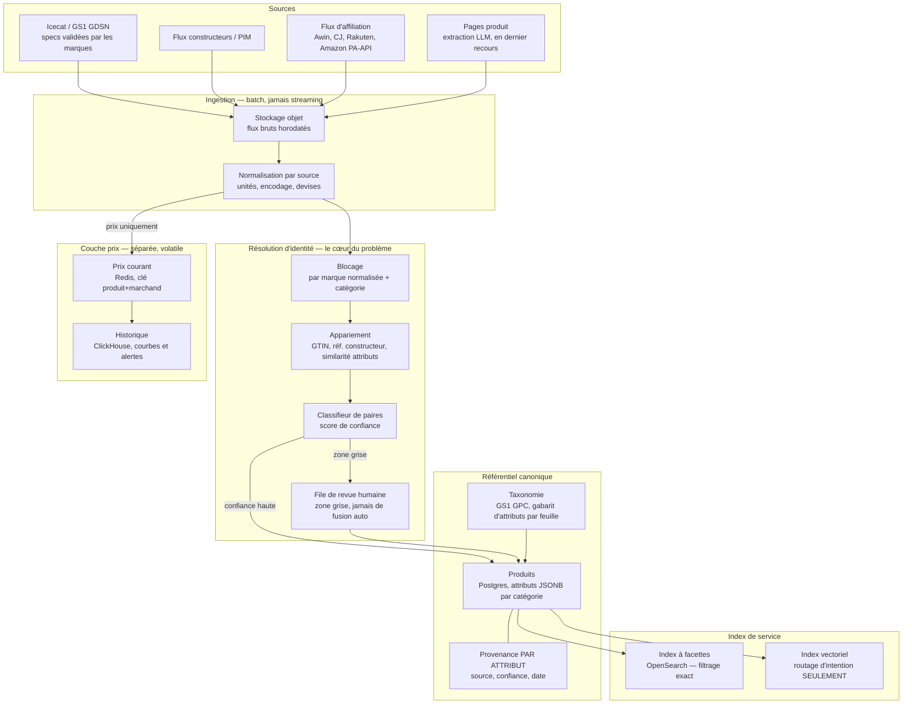

# Architecture cible — passage à l'échelle généraliste

> **Statut : exploratoire.** Ce dossier ne fait pas partie du MVP et n'engage
> aucune ligne de code. Il répond à une seule question : *qu'est-ce qui change,
> et qu'est-ce qui ne change pas, si ce projet devait couvrir tous les produits
> plutôt que six catégories ?*
>
> La réponse courte est en bas de page : **la couche de raisonnement ne change
> pas, seule la couche données grossit.**

---

## 1. Ce qui motive cette architecture

Trois observations qui déterminent tout le reste.

**Les specs et les prix ont des cycles de vie opposés.** Un SSD ne change jamais
de capacité ; son prix change plusieurs fois par jour. Stocker les deux dans la
même table revient à réécrire une ligne de quarante attributs pour modifier un
nombre. Ce sont deux référentiels distincts, avec deux technologies distinctes.

**Le problème dur n'est pas le stockage, c'est l'identité.** Faire correspondre
« SAMSUNG 990 PRO 2To M.2 NVMe » chez un marchand à « Samsung SSD 990 Pro 2TB
PCIe4 » chez un autre, et aux specs constructeur, est l'essentiel du travail
d'ingénierie d'un comparateur. Une base de données ne résout pas ça.

**Le coût ne se trouve pas là où on le cherche.** À 100 000 utilisateurs actifs,
la base est un problème résolu. C'est l'inférence LLM qui domine, et elle croît
linéairement avec les conversations pendant que l'infrastructure reste forfaitaire.

---

## 2. Chaîne de données — de la source au catalogue interrogeable



### Notes de conception

**Provenance par valeur d'attribut, pas par produit.** `capacité = 2000 GB,
source = constructeur, confiance = 1.0` n'a pas le même statut que
`autonomie = 8h, source = extraction LLM, confiance = 0.7`. Cette granularité
permet d'**interdire au moteur de filtrer dur sur un attribut non vérifié** —
c'est la version à grande échelle du refus de combler les `null` de `keyboard`
décidé en 3.4quater.

**La taxonomie s'achète, elle ne s'écrit pas.** Produire à la main un schéma
d'attributs pour 5 000 catégories est hors d'atteinte — l'étape 3 a montré ce
que ça coûte pour sept. GS1 GPC ou la taxonomie Google fournit l'arbre, Icecat
les gabarits d'attributs par catégorie feuille. On affine à la main les ~200
catégories qui portent le trafic, on assume le reste en qualité dégradée.

**Jamais de fusion automatique en zone grise.** Un appariement erroné affiche le
prix d'un produit sur la fiche d'un autre. C'est une faute commerciale, pas un
défaut d'affichage.

**Le batch suffit.** Les flux d'affiliation sont rafraîchis quotidiennement ou
toutes les heures. Le « temps réel » se réduit à du polling API sur le top N des
produits consultés — quelques milliers de références, pas des millions. Mettre du
streaming ici serait une complexité gratuite.

---

## 3. Chemin d'une requête — l'invariant, inchangé

```mermaid
flowchart TD
    U["Utilisateur<br/>« un truc pour bosser dans le train sans prise »"]

    A["Agent LLM<br/>conduite du dialogue"]

    subgraph ROUTE["Routage d'intention — vectoriel"]
        V["Recherche sémantique<br/>→ catégorie + axes de besoin"]
    end

    subgraph DET["Sélection — 100 % déterministe, sans LLM"]
        F["Filtres durs<br/>requête à facettes exacte"]
        SC["Scoring pondéré<br/>+ trace d'explication"]
        PR["Jointure prix<br/>budget appliqué ici"]
    end

    M["Choix du marchand<br/>APRÈS classement"]
    V2["Validateur anti-hallucination<br/>IDs, prix, valeurs chiffrées"]
    R["Réponse<br/>1 à 3 produits, cités par ID"]

    COM["Taux de commission"]

    U --> A
    A -->|"besoin flou"| V
    V -->|"catégorie + critères"| F
    A -->|"critères explicites"| F
    F --> SC --> PR --> M
    PR -->|"produits réels uniquement"| A
    A --> V2 --> R
    COM -.->|"BARRIÈRE<br/>n'entre jamais<br/>dans le classement"| M

    style DET fill:#1a3a2a,stroke:#4a8
    style COM fill:#3a1a1a,stroke:#a44
```



### Le rôle du vectoriel, et ses limites

**Le RAG ne sert pas à chercher des produits.** « SSD NVMe 2 To, PCIe 4.0, moins
de 200 € » est une requête structurée : la recherche vectorielle y est lente,
approximative et non reproductible, là où un index à facettes est exact et
instantané.

Le vectoriel sert à une seule chose : traduire une formulation vague en
**catégorie et axes de besoin**. Une fois ce routage fait, on repasse en
filtrage déterministe.

La règle du projet est donc inchangée à toute échelle :

> Le LLM et le vectoriel choisissent **où chercher**.
> Ils ne choisissent jamais **quel produit**.

---

## 4. Le conflit d'intérêts, traité comme une contrainte d'architecture

Un conseiller rémunéré à l'affiliation a un intérêt financier à ce que
l'utilisateur achète, et à ce qu'il achète chez le marchand qui paie le mieux.
L'argument central de ce projet est l'honnêteté du conseil. Les deux entrent en
collision.

La barrière doit être structurelle, pas contractuelle :

- le moteur de matching **ne reçoit jamais** le taux de commission en entrée ;
- le classement sort du score de pertinence seul ;
- le choix du marchand intervient **après**, sur un produit déjà classé.

Une barrière qui n'existe que dans une note de cadrage finit par céder. Celle-ci
doit être une signature de fonction.

**Contraintes réglementaires** — à faire valider par un juriste, je n'en suis pas
un. La directive Omnibus (UE 2019/2161) impose de divulguer les placements
rémunérés dans un classement ainsi que ses principaux paramètres ; l'affichage
d'un prix comparé suppose d'indiquer sa date de relevé. Conséquence directe sur
le modèle de données : **horodatage de collecte obligatoire sur chaque prix**,
non nullable.

---

## 5. Ce que coûte l'échelle, et où

À 100 000 utilisateurs actifs, l'ordre de grandeur :

```
100 000 utilisateurs × 3 sessions/mois × 8 tours ≈ 2,4 M appels LLM / mois
```

La base de données est un coût **forfaitaire**. L'inférence est un coût
**proportionnel aux conversations**. C'est cette inversion qu'il faut concevoir,
pas le partitionnement Postgres — un catalogue de dizaines de millions de
produits en lecture, largement cacheable, tient sur une infrastructure modeste.

Leviers, par effet décroissant :

| Levier | Effet |
| --- | --- |
| Cache du prompt système | Le prompt est long et stable — c'est le gain le plus direct |
| Petit modèle pour l'extraction, grand modèle pour la synthèse seule | Déplace le volume vers le tarif bas |
| Ne jamais renvoyer le catalogue dans le contexte | Seuls les produits retenus y entrent, jamais les candidats |
| Plafond de tours par session | Borne le pire cas, qui est ce qui fait exploser une facture |

---

## 6. Ce qui change, et ce qui ne change pas

| Couche | À l'échelle du MVP | À l'échelle généraliste |
| --- | --- | --- |
| Dialogue et extraction des critères | Agent LLM avec outils | **Identique** |
| Sélection des produits | SQL déterministe + scoring Python | Index à facettes + scoring — **même principe** |
| Reformulation | LLM sur les seuls produits retournés | **Identique** |
| Validateur anti-hallucination | Parsing + vérification sur IDs | **Identique**, indifférent au volume |
| Catalogue | 1 seed figé, 6 catégories | Chaîne d'ingestion + résolution d'identité + taxonomie |
| Prix | Colonne dans la table produit | Référentiel séparé, chaud/froid, horodaté |
| Attributs | Schéma écrit à la main | Gabarits achetés + extraction, provenance par valeur |

**La couche de raisonnement ne bouge pas.** Ce qui grossit — et ce qui devient
réellement difficile — est entièrement en amont : identité, taxonomie, fraîcheur
des prix. C'est une bonne nouvelle pour le MVP : il construit la bonne chose en
petit, et ce qu'il faudra ajouter est adjacent, pas substitutif.
